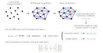
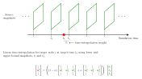

# Mapped precursor ABL boundary condition
This user-defined boundary condition handles the mapping of the velocity, temperature and pressure fields onto the selected boundary at runtime. It relies on having a database of VTK-formatted (ascii or binary) snapshots for each of these variables. Although the mapping algorithm is generic to a certain extent, this boundary condition has been developed in the context of using precursor turbulent atmospheric boundary layer (ABL) simulations in HORSES3D. Hence, some particularities and restrictions to its use apply and are detailed in the sections below. There are no explicit requirements on the methods used to generate the source snapshots, only on their format, which must be a POLYDATA dataset containing only square polygons (4 vertices) describing a $yz$ plane (constant $x$ values). Find [here](./PRECURSOR/17000/) examples of said formats for vector and scalar variables generated using OpenFOAM-2.3.1's `sliceDataInstantaneous` `fieldFunctionObject` for sampling.

## Installation
To compile this custom boundary condition, simply add the files [precursor.f90](./SETUP/precursor.f90), geompack2.f90 and [ProblemFile.f90](./SETUP/ProblemFile.f90) to the case [SETUP](./SETUP/) folder, and compile them via `make` with the same flags used to compile HORSES3D and the corresponding custom [Makefile](./SETUP/Makefile.iABL) (remember to rename simply as 'Makefile'), where in the definition of `HOME_DIR`, `<horses3d_install_dir>` has to be substituted by the path to your HORSES3D installation root directory.

>[!NOTE]
> If your HPC platform requires a specific set of compiler flags, remember to modify the provided Makefile template accordingly before compilation.

The external library GEOMPACK2 (see references [[1]](#1) and [[2]](#2)) source code can be downloaded as follows:

```
wget -P ./SETUP/ https://people.math.sc.edu/Burkardt/f_src/geompack2/geompack2.f90
```

## Usage
After [compiling](#installation) the custom boundary condition code and declaring the `inlet` boundary as `user-defined` in the simulation control file, HORSES3D will expect to find a [PRECURSOR](./PRECURSOR/) directory containing a driver file named [precursor.dat](./PRECURSOR/precursor.dat) and a set of subdirectories containing the VTK snapshots for each variable:

```
├── <simulation_driver>.control
├── RESULTS
├── MESH
├── SETUP
│   ├── ProblemFile.f90
│   ├── precursor.f90
│   ├── geompack2.f90
│   └── Makefile
└── PRECURSOR
    ├── precursor.dat
    ├── <t_0_dir>
    │    ├── <U_filename>.vtk
    │    ├── <p_filename>.vtk
    │    └── <T_filename>.vtk
    ├── <t_1_dir>
    │    ├── <U_filename>.vtk
    │    ├── <p_filename>.vtk
    │    └── <T_filename>.vtk
    ...
```
The driver file [precursor.dat](./PRECURSOR/precursor.dat) has a simple structure,

```
############################
### WIND PRECURSOR TABLE ###
############################
# Number of directories
2
# File names for u (m/s), T (K), p (Pa)
U_slice_boundary.vtk T_slice_boundary.vtk p_rgh_slice_boundary.vtk
# File format: ascii/binary
ascii
# Time (s), directory
0.0 17000
0.25 17000.25

```
where the expected inputs, in order, are

1. An integer specifying the number of directories (snapshots) to be found.

2. Strings separated by a single space indicating the names of the VTK files contaning the velocity (vector), temperature and pressure (scalar) fields. Note that these fields must be expressed in their dimensional form with units of m/s, K and Pa, respectively.

3. A string specifying the VTK file format, either ascii or binary. The expected binary format is custom, not VTK standard, hence source files must always be generated from already compatible ascii files via the conversion tool [ascii_to_binary_vtk.f90](./tools/ascii_to_binary_vtk.f90). The expected file compression is typically between 35 and 40 %.

4. A two column table of the same size of the specified value for the number of directories,
    * First column: HORSES3D simulation time, in seconds.
    * Second column: name of the directory containing the VTK files for the boundary values at the corresponding HORSES3D time.

>[!IMPORTANT]
>This custom boundary condition has been intially developed to map turbulent atmospheric boundary layer (ABL) flows. In these cases, buoyancy is typically modelled via Boussinesq approximation,
>
>$$\rho = \rho_{ref}  \left(1.0 - \dfrac{T - T_{ref}}{T_{ref}}\right)$$
>
>where $T$ is the potential temperature, while $\rho_{ref}$ and $T_{ref}$ are refrence values for density and temperature. Hence, in this implementation the density field $\rho$ is computed accordingly before mapping, using the reference values $\rho_{ref} = 1.177$ kg/m<sup>3</sup> and $T_{ref} = 300$ K. Additionally, the expected input pressure field is $p_{\textrm{rgh}}$, defined as
>
>$$p_{\textrm{rgh}} = p - \rho\left(\vec{g} \cdot \vec{h} \right)$$ 
>
>where $\vec{g}$ and $\vec{h}$ are the gravity and height vectors.
>
>These restrictions can be modified by manipulating the [ProblemFile.f90](./SETUP/ProblemFile.f90) to, for example, directly map density from source to target boundary. In future implementations, all these setup characteristics could be defined in the input driver file.

>[!WARNING]
>Currently both source and target surfaces must be defined as an $yz$ plane for the mapping tool to work. In future implementations, the source and target plane axes and their correspondance could be specified in the `precursor.dat` input file.
>
>The current implementation of this boundary condition only supports parallelization through MPI. Multithreading (OpenMP) is not supported, hence running a simulation with >1 CPUs per task will lead to memory segmentation faults associated to I/O operations.

## Space interpolation
Regarding the spatial interpolation method, a pre-processing stage computes a Delaunay 2D triangulation of the computed source polygon centroid points making use of the external, open source library [GEOMPACK](https://people.math.sc.edu/Burkardt/f_src/geompack/geompack.html) by Barry Joe and John Burkardt (see [[1]](#1) and [[2]](#2) for more detail). Then, each target point (boundary integration node in HORSES3D) is expressed in terms of the barycentric coordinates of the source triangulation element where they lie. The values of said barycentric coordinates correspond to the linear interpolation weights that will be applied to corresponding vertex values of the source triangulation to obtain the target value. The 3 interpolation weights for each target node are stored in a matrix. Additionally, the indexing of the 3 vertices of the triangles used for the interpolation of each target value in the source triangulation are stored in a connectivity matrix. In the case of a target node falling outside of the boundaries of the source triangulation, all values will be mapped using the closest source point.

>[!WARNING]
>Currently, the conectivity and weights matrices are built at simulation start/restart, so this mapped boundary condition is not yet compatible with p-adaptation.

To support MPI execution, a hashtable is built where an input, univoque integer codification of the coordinates of each target node returns its indexing on the weights and connectivity matrices. Hence, the interpolation operation for each target node at runtime simply requires encoding the $y$ and $z$ coordinates of the target node, using the lookup hashtable to obtain the corresponding target node indexing on the weights and connectivity matrix, accessing said connectivity and weights matrices to obtain the source values for each variable and their corresponding linear interpolation weights, then finally performing a weighted sum to obtain the interpolated value.

<p align="center">
   
</p>

>[!NOTE]
> The use of a hashtable and the enconding of each one of the target node coordinates in every MPI process would not be necessary if boundary nodes in `ProblemFile::UserDefinedState1` (function called at each time iteration for every `user-defined` boundary) where indexed globally as in `ProblemFile::UserDefinedFinalSetup` (function called at simulation startup where the pre-processing stage occurs) or a connectivity matrix for local-to-global indexing were stored. However, in the context of user-defined boundary conditions via `ProblemFile` this option was not available at the time of developing this code.

## Time interpolation
Once the simulation starts running, for each time step the boundary condition will find the interval where the current time lies and linearly interpolate each variable boundary field using its lower and upper bounds. 

<p align="center">
   
</p>
Source VTK snapnshots will only be read if the target time changes interpolation intervals, guaranteeing minimal computational overhead.

## References
<a id="1">[1]</a> 
Franz Aurenhammer,
Voronoi diagrams - a study of a fundamental geometric data structure,
ACM Computing Surveys,
Volume 23, Number 3, pages 345-405, September 1991.

<a id="2">[2]</a>
Barry Joe,
GEOMPACK - a software package for the generation of meshes using geometric algorithms,
Advances in Engineering Software,
Volume 13, pages 325-331, 1991.